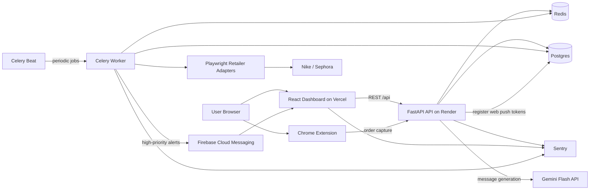

# Architecture

## System Diagram

## Runtime Responsibilities
- **Dashboard**: authenticated user experience, alert review, notification opt-in, and settings updates.
- **Extension**: retailer order capture from supported storefront pages (Nike and Sephora).
- **API**: authentication, order ingestion, alert and price history APIs, user preferences, cancellation guidance lookup, AI message generation (Gemini), outcomes logging, savings summary, push token registration, and health checks.
- **Postgres**: source of truth for users, orders, order items, price snapshots, delivery events, alerts, outcome logs, push device tokens, and user preferences.
- **Redis**: Celery broker/result backend plus coordination store for cache, throttling, and scraper reliability state (circuit-breaker flags, backoff counters).
- **Worker**: scheduled price checks and delivery polling, dispatching FCM push notifications for qualifying alerts.
- **Scrapers**: retailer-specific Playwright adapters that normalize price and delivery data into shared DTOs. Nike and Sephora implement both price checks and delivery polling (requires authenticated Playwright storage state).
- **Gemini Flash API**: on-demand AI message generation. Called synchronously by the API to draft customer support messages (price match requests, return requests, delivery inquiries) in a user-selected tone.
- **Sentry**: application and worker error tracking with environment-aware sampling.

## Data Flow Highlights
1. Extension captures an order and posts it to the API.
2. API stores the order, items, and baseline price snapshots in Postgres.
3. Celery Beat enqueues `price_check_cycle` and `delivery_check_cycle` jobs on a configurable interval.
4. Worker uses Playwright adapters to scrape retailer price data (Nike, Sephora) and writes normalized results; creates alerts for qualifying price drops or delivery anomalies.
5. Worker dispatches FCM push notifications to registered browser tokens for high-priority alerts.
6. Dashboard loads alerts, price history, preferences, and savings summary from the API.
7. User requests a customer support message draft; API calls Gemini Flash synchronously, caches the result in Redis, and returns the generated text.
8. User records an outcome (price matched, returned, ignored); API logs it to `outcome_logs` for the savings summary.

## Known Implementation Gaps
- Nike and Sephora delivery polling requires manually provisioned Playwright storage-state files (`NIKE_STORAGE_STATE` / `SEPHORA_STORAGE_STATE` env vars). Without them every delivery check raises `RetailerNotReadyError` and is skipped. There is no in-app flow to capture or refresh these sessions.
