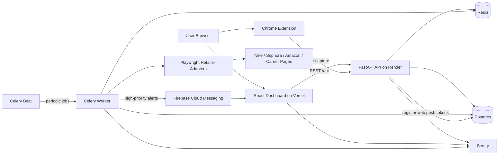

# Architecture

## System Diagram

## Runtime Responsibilities
- Dashboard: authenticated user experience, alert review, notification opt-in, and settings updates.
- Extension: retailer order capture from supported storefront pages.
- API: authentication, order ingestion, alert/message APIs, user preferences, cancellation guidance lookup, and health checks.
- Postgres: source of truth for users, orders, items, alerts, subscriptions, push tokens, and delivery/price history.
- Redis: Celery broker/result backend plus coordination store for cache, throttling, and scraper reliability state.
- Worker: scheduled price checks, delivery polling, subscription refresh, and push dispatch.
- Scrapers: retailer-specific Playwright adapters that normalize price and delivery data into shared DTOs.
- Sentry: application and worker error tracking with environment-aware sampling.

## Data Flow Highlights
1. Extension captures an order and posts it to the API.
2. API stores the order, items, and baseline price snapshots in Postgres.
3. Celery Beat enqueues price, delivery, and subscription refresh jobs.
4. Worker uses Playwright adapters to scrape retailer data and writes normalized results.
5. Worker creates alerts and dispatches FCM notifications for qualifying high-priority alerts.
6. Dashboard loads alerts, price history, and preferences from the API and can register an FCM token for browser push.
